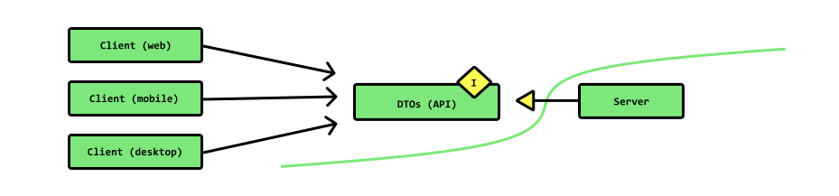

# NLW Copa | Fastify with TypeScript


> Project made at the event `Next Level Week | Copa` held by `Rocketseat`, the purpose of this event was to build an end-to-end application
> in which people can create pools, receive a code, and so she can send her pool for friends to participate and their friends can
> send your predictions for different matches of the World Cup games. The backend of the application relies on `Fastify` to develop servers for
> web API services, `TypeScript` and `Zod` to validate, process and type data coming from requests and so that we have a more robust backend.

:arrow_right: Fastify with TypeScript <br />
:arrow_right: Zod | Data validation library <br />
:arrow_right: Data Transfer Object (DTO) <br />
:arrow_right: Server Side Rendering (SSR) <br />

<br />

## Fastify with TypeScript

Given one of the core goals of the project is `performance`, we do not land any feature if the implementation isn’t well optimized and the cost that we pay is as low as possible. Tomas Della Vedova — Lead maintainer of Fastify.

Fastify is `extremely fast`, in its benchmark tests it receives more than 31 thousand requests/second, this performance extends to core-features, one of them is `Schema based`, it has a standardization scheme of data output in your routes, fastify strongly recommends you to `standardize your responses`, using some `JSON Schema, which guarantees that your data will be delivered correctly` and you will still get 10 to 20% of performance, this is connected to the fact that internally fastify compiles the schema into a high performance function.

```ts
import Fastify from 'fastify'

const fastify = Fastify({
    logger: false,
})

const handler = (req, reply) => {
  reply.send({ hello: 'world' })
}

const route = {
  method: 'GET',
  url: '/',
    schema: {
    querystring: {
      name: { type: 'string' },
      excitement: { type: 'integer' }
    },
    response: {
      200: {
        type: 'object',
        properties: {
          hello: { type: 'string' }
        }
      }
    }
  }
}

fastify.route(route, handler)

fastify.listen(3000)
```

Using the `response property`, which is part of the `schema object`, it is possible to treat http responses by code, eg: 200, 201, 202... or just generically, eg: 2xx.

```ts
const schema = {
  response: {
    '2xx': {
      type: 'object',
      properties: {
        value: { type: 'string' },
        otherValue: { type: 'boolean' }
      }
    },
    201: {
      type: 'object',
      properties: {
        value: { type: 'string' }
      }
    }
  }
}

fastify.post('/the/url', { schema }, handler)
```

In the above way, you can `exactly standardize your answers`, of course, this standardization does not eliminate tests in your application in any way. But they serve as a support and basis, `to guarantee even more the integrity of the information returned in their answers`. Even fastify has a request injection scheme, precisely to facilitate testing your application.

Fastify is a real different approach, it `provides a light and small core` that is easy to extend with plugins and mature your application based on services, `focusing on performance and low overhead`. The architecture pattern that is used to build it enables ready-made, lightweight, and robust applications for microservices.

### Typing data and handling errors and exceptions

`Fastify request objects` have four dynamic properties: body, params, query, and headers. Their respective types are assignable through this interface. It is a named property interface enabling the developer to ignore the properties they do not want to specify. All omitted properties are defaulted to `unknown`. The corresponding property names are: `Body, Querystring, Params, Headers`.

```ts
// src/dtos.ts
export interface GuessesByPool {
  poolId: string
}

// src/controllers/app-controller.ts
async guessesByPoolId(
  request: FastifyRequest<{ Querystring: GuessesByPool }>,
  reply: FastifyReply
) {
  const guessesByPoolIdQuery = z.object({
    poolId: z.string({
      required_error: 'poolId is required',
    }),
  })
  try {
    const { poolId } = guessesByPoolIdQuery.parse(request.query)

    const guesses = await prisma.participant.findMany({
      where: {
        poolId,
      },
      include: {
        guesses: true,
      },
    })

    return reply.status(200).send({ guesses })
  } catch (error) {
    new TriggersError(error, reply)
  }
}

// src/utils/TriggersError.ts
export class TriggersError {
  constructor(error: any, reply: FastifyReply) {
    console.error(error)
    return reply.status(500).send({
      status: false,
      msg: error.message,
    })
  }
}
```

<br />

## Zod | Data validation library 

Zod is a library that `allows you to define rules for validating data`, Zod will automatically generate Typescript types for you, allowing you to use the received data more securely. We use Zod to validate the data that will be received on the REST server. `If ​​the data does not match the defined rules, the server will return an error indicating which field is incorrect and what was expected`.

```ts
// src/dtos.ts
export function CreateGuessParser() {
  return z.object({
    firstTeamCountryCode: z.string({
      required_error: 'firstTeamCountryCode is required',
    }),
    secondTeamCountryCode: z.string({
      required_error: 'secondTeamCountryCode is required',
    }),
    firstTeamPoints: z.string({
      required_error: 'firstTeamPoints is required',
    }),
    secondTeamPoints: z.string({
      required_error: 'secondTeamPoints is required',
    }),
    date: z.string({
      required_error: 'date is required',
    }),
    poolId: z.string({
      required_error: 'poolId is required',
    }),
    userId: z.string({
      required_error: 'userId is required',
    }),
  })
}


// src/controllers/app-controller.ts
async createGuess(
  request: FastifyRequest<{ Body: CreateGuess }>,
  reply: FastifyReply
) {
  const createGuessBody = CreateGuessParser()
  try {
    const { ...data } = createGuessBody.parse(request.body)
    const isAlreadyParticipating = await prisma.participant.findFirst({
      where: {
        poolId: data.poolId,
        userId: data.userId,
      },
    })
    const createParticipant = async () => {
      const participant = await prisma.participant.create({
        data: {
          poolId: data.poolId,
          userId: data.userId,
        },
      })

      return participant
    }

    const participant = isAlreadyParticipating
      ? isAlreadyParticipating
      : await createParticipant()
    const guessAlreadyExistsI = await prisma.guess.findFirst({
      where: {
        participantId: participant.id,
        firstTeamCountryCode: data.firstTeamCountryCode,
        secondTeamCountryCode: data.secondTeamCountryCode,
      },
    })
    const guessAlreadyExistsII = await prisma.guess.findFirst({
      where: {
        participantId: participant.id,
        firstTeamCountryCode: data.secondTeamCountryCode,
        secondTeamCountryCode: data.firstTeamCountryCode,
      },
    })
    if (guessAlreadyExistsI || guessAlreadyExistsII) {
      return reply.status(406).send({ status: false })
    } else {
      const guess = await prisma.guess.create({
        data: {
          firstTeamCountryCode: data.firstTeamCountryCode,
          firstTeamPoints: Number(data.firstTeamPoints),
          secondTeamCountryCode: data.secondTeamCountryCode,
          secondTeamPoints: Number(data.secondTeamPoints),
          date: data.date,
          participantId: participant.id,
        },
      })

      return reply.status(201).send({ guess: [guess] })
    }
  } catch (error) {
    new TriggersError(error, reply)
  }
}
```

In this backend application we use Fastify to create a REST API and we use Zod to validate the data sent by the user, so that the creation of REST APIs becomes increasingly sophisticated and robust, thinking about the integrity and coherence of the data.

<br />

## Data Transfer Object (DTO) 

`DTOs are data transfer objects`. They are not very. `These are simple interfaces or classes that represent the form of your API`.

The idea is to use DTOs to create a contract for your API.

If we modeled the initial form of the user entity as part of our RESTful API, we would likely have a DTO that looks like this.

```ts
// src/dtos.ts

export interface CreateUserRequest {
  name: string
  email: string
  avatarUrl: string
}
```

Then we'd use another pattern, the `data mapper pattern`, to hold the `responsibility of mapping the raw prisma object to the correct DTO shape`.

This can be improved even further by encapsulating the ORM logic in a repository (which is not the case of what was done in this application).

So, instead of relying on the server (and everything the server depends on), clients rely solely on the DTOs.

<div align="center">

</div>

### The advantages are that:

 - The `DTOs become a strict contract for our API`. The clients rely on it. The server implements it.
 - We've implemented architectural `dependency inversion` between the client and the server.
 - The `DTOs` act as a layer of indirection and shield the clients from internal changes to the way the API is resolved.
 - `Data mappers` act as a single location for object transformations. Instead of going through the codebase and changing API code that deals with raw sequelize users all over the place, it's done in one place.

*<i>khalilstemmler.com/articles/enterprise-typescript-nodejs/use-dtos-to-enforce-a-layer-of-indirection</i> <br />

<br />

## Server Side Rendering (SSR) 

Server Side Rendering or SSR `is the process of taking all the Javascript and all the CSS of a website that is usually loaded in the browser (client-side), and rendering them as static on the server`s side.

`With this we can obtain a website with a reduced loading time and fully indexable by SEO's`. But to understand some of this loading time, we have to understand the principles of loading that is performed in your browser to see the real benefit of using some `SSR framework`.

When a page is loaded it needs input (which we call assets). These are `the first contents to be delivered to the browser` so that, from there, it can carry out its work and `render the page` as quickly as possible for the user.

To continue the approach, let's understand how the browser receives and makes use of it on our website.

<div align="center">

</div>

Initially when we access content on the web, we have a `reference in the HTML document` that tells us what will be loaded and will also be the first thing that the browser will receive, `this document contains all the necessary references for the following assets, such as images , CSS and javascript`.

The browser knows from this that it needs to go somewhere to locate and download these assets, as it builds the document. So, `even if the browser contains all of your HTML structure, it won't be able to render something friendly until the corresponding CSS, which contains all of your styling, is also loaded`.

Once done, your browser may have some relevant content to deliver to the user. After this process is finished, the browser will `download all javascript files` and that's where most of the problems tend to be.

The files can be large and with the use of a bad internet the loading time can be long. In this way, your user experience will not be ideal, which can get worse if the first rendering depends on a javascript file.

`The big advantage of using SSR is that we can deliver, almost immediately, meaningful content to the user`.

This happens because the HTML and its main assets are loaded in the same file and delivered to the client.

Therefore, we eliminated some steps in the process of downloading assets and the browser is only in charge of loading the created components and their flows that are also in a minified file. As a good practice, I strongly recommend using a CDN to cache these files.
Benefits of using SSR

 - Faster loading on initial render
 - Because we have all the structure ready, we have a fully indexable HTML page. In this case great for SEO and Crawlers.

### SSR with Next.js

If a page uses Server-side Rendering, the page HTML is generated on each request.

To use Server-side Rendering for a page, you need to export an async function called getServerSideProps. This function will be called by the server on every request.

For example, suppose that your page needs to pre-render frequently updated data (fetched from an external API). You can write getServerSideProps which fetches this data and passes it to component like below:

```tsx
// src/pages/index.tsx
export const getServerSideProps = async () => {
  const [poolCountResponse, guessCountResponse, userCountResponse] =
    await Promise.all([
      api.get('pools/count'),
      api.get('guesses/count'),
      api.get('users/count'),
    ])

  return {
    props: {
      poolCount: poolCountResponse.data.count,
      guessCount: guessCountResponse.data.count,
      userCount: userCountResponse.data.count,
    },
  }
}

export default function Home(props: Props) {}

// src/pages/pool/[code].tsx
export const getServerSideProps = async (context: any) => {
  const pool = await api
    .get(poolByCode, {
      params: {
        code: context.params.code,
      },
    })
    .then(({ data }) => data)
    .catch((error) => console.log(error.toJSON()))

  return {
    props: {
      ...pool,
    },
  }
}

export default function PoolCode({ pool }: Props) {}
```

If you export a function called getServerSideProps (Server-Side Rendering) from a page, Next.js will pre-render this page on each request using the data returned by getServerSideProps.

*<i>medium.com/techbloghotmart/o-que-%C3%A9-server-side-rendering-e-como-usar-na-pr%C3%A1tica-a840d76a6dca</i> <br />
